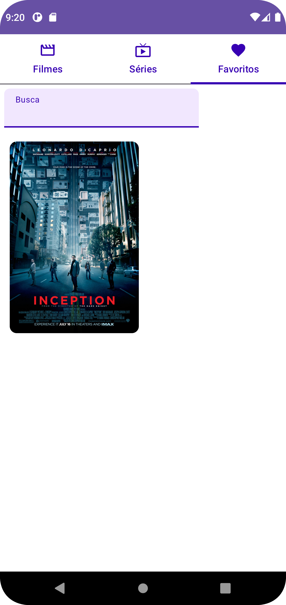
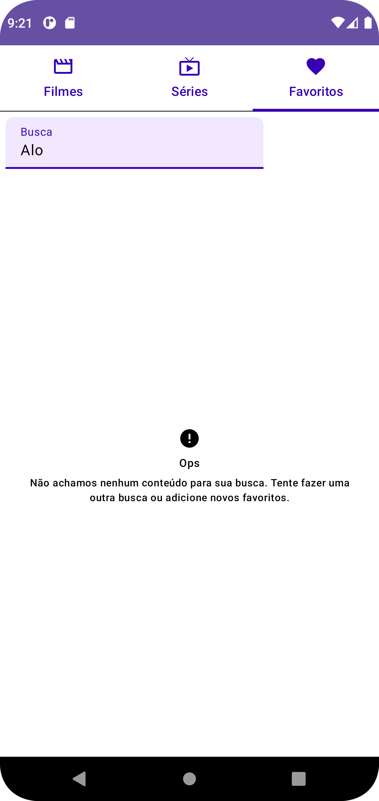

Projeto Android utilizando Jetpack Compose.
Arquitetura utilizada: MVVM (alguns princípios CLEAN)

Aplicativo de listagem de filmes consumindo a API do IMDb. Possui 3 áreas principais: Filmes, Séries e Favoritos (que lista tanto filmes como séries).
Nas Tabs de Filmes e séries é possível alternar entre 2 modos de busca: Top250 e Busca Avançada, na ultima aparece um input de text que permite o usuário fazer a busca que deseja.

Nas listagens é possível favoritar/desfavoritar um filme/série ou clicar no poster em si, e assim ter uma visualização expandida do título.

Tela inicial no modo Top 250

Modo de busca:


Tela de favoritos:



Para rodar o projeto é preciso criar arquivo um arquivo "apiKey.properties":
```
IMDb_API_KEY="{imdb_api_key}"
```